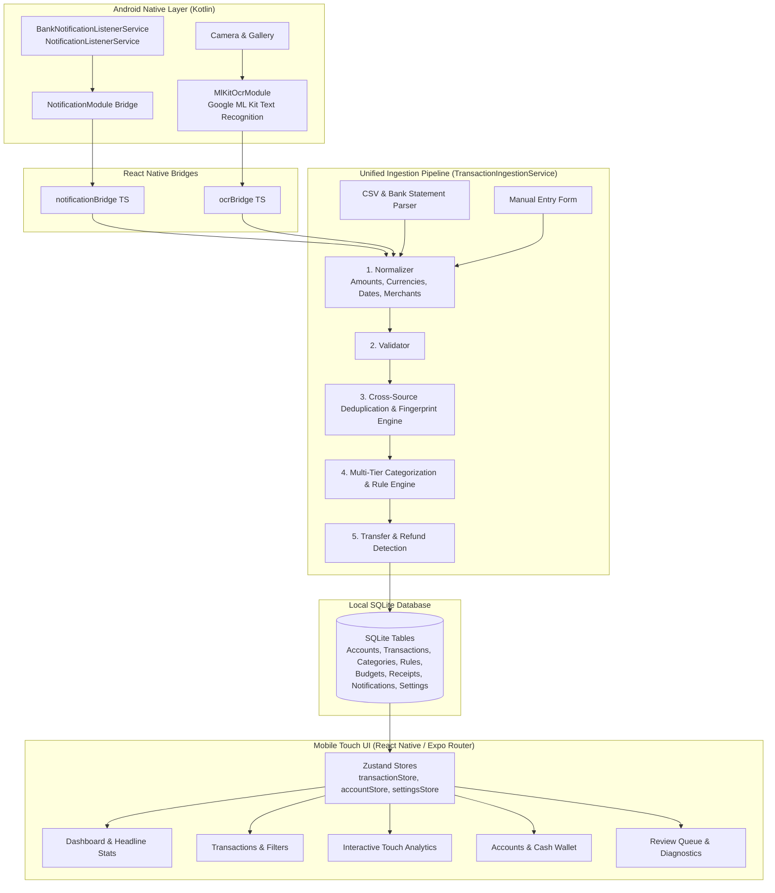

# Architecture & System Design

## 1. Overview & Vision
This application transforms the personal finance tracking experience from manual bookkeeping to an automated, privacy-conscious, local-first Android application.

The core design centers around two automated ingestion streams:
1. **Bank Transaction Extraction from Android Notifications**: Ingestion via a real Kotlin `NotificationListenerService` that intercepts payment alerts from supported banks (Revolut, OTP, Erste, MBH, Wise, Generic), parses transaction details, verifies duplicates, auto-categorizes, and updates the dashboard immediately.
2. **Receipt Photography + On-Device OCR**: Captures physical receipts using full-screen camera framing guides, runs on-device Google ML Kit Text Recognition, detects Hungarian and English semantic patterns (`FIZETENDŐ`, `ÖSSZESEN`, `ÁFA`, `KÉSZPÉNZ`, `BANKKÁRTYA`), links cash payments automatically to the Cash account, and provides a review modal before committing.

Both automated methods—along with CSV statement imports and manual entry—feed into a **Unified Ingestion Pipeline** (`TransactionIngestionService`).

---

## 2. Multi-Layer Architecture

---

## 3. The 6-Stage Ingestion Pipeline

All transaction inputs pass through `TransactionIngestionService.ingest()`:

1. **Normalization**:
   - `normalizeWhitespace()`: Strips thin and non-breaking Unicode spaces (`\u00A0`, `\u202F`).
   - `parseNumericAmount()`: Resolves European comma decimals vs dot thousands (`14.500,50` vs `14,500.50`).
   - `toMinorUnits()`: Scales amounts to integer minor units (1 HUF = 100 minor units/fillér; 1 EUR = 100 cents) ensuring floating-point inaccuracy never corrupts financial math.
   - `normalizeDate()`: Resolves Hungarian and ISO dates into strict `YYYY-MM-DD`.
   - `cleanMerchantName()`: Strips legal entity suffixes (`Kft`, `Zrt`, `Nyrt`) and bank noise.

2. **Validation**:
   - Checks presence of required fields, valid date formatting, non-zero amount, valid ISO-4217 currency, and target account.

3. **Cross-Source Deduplication**:
   - Computes deterministic SHA/FNV fingerprint: `date|amountMinor|currency|normalizedText|externalId`.
   - Fuzzy cross-source matching detects when the same real-world purchase arrives via different sources (e.g. Bank Notification followed by a monthly CSV statement import, or Receipt scan followed by a Card notification).

4. **Multi-Tier Smart Categorization**:
   - Evaluates high-priority user-learned rules first.
   - Evaluates known merchant rules and regex/contains patterns.
   - Falls back to transaction direction (e.g., `income` fallback).
   - Stores confidence score (0.0 to 1.0).

5. **Transfer & Refund Detection**:
   - Internal transfers between user accounts are classified as `transfer` and excluded from income/expense calculations so statistics remain financially accurate.

6. **Persistence & Reactive Notification**:
   - Records transaction into local SQLite database.
   - Emits updates to Zustand stores to instantly refresh UI.

---

## 4. Technology Decisions

| Technology | Rationale |
|---|---|
| **React Native & Expo Prebuild** | Native Android performance combined with cross-platform TypeScript domain logic. Requires prebuild/development build for real `NotificationListenerService` and ML Kit. |
| **Kotlin** | Clean, concise native Android implementation without legacy Java boilerplate. |
| **Google ML Kit Text Recognition** | Fast, on-device OCR model with full offline capability and Hungarian diacritics support. |
| **SQLite** | Replaces web `localStorage`. ACID compliance, fast indexing on dates, accounts, categories, and fingerprints. |
| **Zustand** | Lightweight, predictable state management without heavy Redux boilerplate. |
| **Integer Minor Currency Units** | Eliminates JavaScript floating-point errors (e.g., `0.1 + 0.2 !== 0.3`). |
