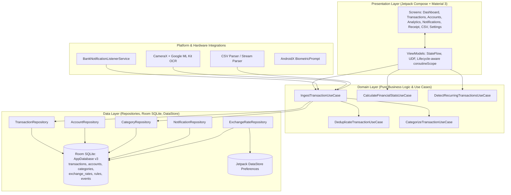

# Native Android Architecture & System Design

## 1. Executive Summary & Design Vision

**Finances** (`com.teppe21.finances`) is a production-grade, 100% native Android personal finance application built with modern Kotlin, Jetpack Compose, Material 3, and Room SQLite. It targets **Android 16 (API level 36)** with a `compileSdk` of 36 and `minSdk` of 26 (Android 8.0 Oreo).

The application eliminates the friction of manual expense bookkeeping through two real-time on-device automation channels:
1. **Real-Time Bank Transaction Ingestion**: A background `NotificationListenerService` (`BankNotificationListenerService`) captures transaction notifications from major European and Hungarian banking apps (Revolut, OTP Bank, Erste George, MBH Bank, Wise, and generic banking templates) directly into the database.
2. **On-Device Receipt Scanning**: CameraX hardware integration combined with Google ML Kit On-Device Text Recognition extracts merchant names, total amounts, dates, VAT breakdown, and payment methods without transmitting receipt photos to any external cloud API.

Both automation feeds—together with CSV statement imports and manual entry—converge into a deterministic, unified ingestion pipeline that guarantees deduplication, automatic categorization, and transfer detection.

---

## 2. Layered Architecture (Clean Architecture + MVVM)

The project adheres strictly to Clean Architecture principles with unidirectional data flow (UDF) powered by Kotlin Coroutines and Kotlin Flow:

---

## 3. The Unified Ingestion Pipeline

Every transaction entered into the system—regardless of whether it originated from a push notification, physical receipt, CSV statement, or manual entry—passes through `IngestTransactionUseCase`.

### Step 1: Text Normalization & Merchant Cleaning
Raw input strings (such as `LIDL BP DEAK TER 12`, `Fizetés a következőnek: SPAR`, or `POS PURCHASE 03/28 MCDONALDS`) are cleaned using `TextNormalizer`:
- Common banking prefixes and stop words are stripped (`Fizetés:`, `Vásárlás:`, `POS:`, `Kártyás vásárlás:`, legal suffixes like `Kft.`, `Zrt.`, `Nyrt.`, `GmbH`, `LLC`).
- Hungarian and accented characters are preserved for presentation but normalized for index searching.

### Step 2: Deterministic SHA-256 Fingerprinting
To guarantee idempotency across multiple syncs or repeated imports, each transaction receives a deterministic cryptographic fingerprint:
$$\text{Fingerprint} = \text{SHA-256}(\text{date} \parallel \text{amountMinor} \parallel \text{currency} \parallel \text{normalizedMerchant} \parallel \text{externalId})$$

### Step 3: High-Performance Indexed Deduplication
Earlier versions performed an in-memory scan of all database records. The hardened architecture executes indexed, constant-time database queries:
1. **Exact Fingerprint Lookup**: Queries `findByFingerprint(fingerprint)` via the unique B-Tree index on `transactions.fingerprint`. If found $\rightarrow$ flagged as `EXACT_DUPLICATE` and discarded.
2. **External ID Lookup**: If provided (e.g. from bank statement references), queries `findByExternalId(externalId)` via index $\rightarrow$ flagged as `EXACT_DUPLICATE`.
3. **Fuzzy 2-Day Match**: Queries `findPossibleDuplicates(amountMinor, currency, date - 2 days, date + 2 days)` using the composite index `(amountMinor, currency, date)`. If candidate exists $\rightarrow$ flagged as `POSSIBLE_DUPLICATE` and held for user review.
4. **Unique**: Transaction passes forward for insertion.

### Step 4: Rule-Based Categorization & Transfer Detection
1. **Transfer Recognition**: Phrases like `átutalás`, `átvezetés`, `pénzküldés`, `bank transfer`, or `transfer to` immediately classify the transaction as `TransactionDirection.TRANSFER` and assign the `transfers` category.
2. **Keyword Rule Matching**: User-defined and built-in category keyword rules (`food`, `dining`, `transport`, `subscriptions`, `housing`, etc.) are evaluated against the cleaned merchant and description text.
3. **Fallback**: If no rule matches, the transaction is marked as `other` (Uncategorized) for user review.

---

## 4. Multi-Currency Engine & FX Architecture

All financial calculations and storage use integer minor units (e.g., `Long` where `100` = `1.00 HUF` or `1.00 EUR`) to guarantee 100% mathematical precision with zero floating-point drift.

The app supports dynamic multi-currency display:
- **Original Currency Preservation**: Every transaction permanently stores its original `amountMinor` and original ISO 4217 `currency`.
- **Display Currency Conversion**: When the user changes their global display currency (e.g., from HUF to EUR or USD), balances and summaries are converted in real time using real exchange rates from `ExchangeRateRepository`.
- **Offline-First Resilience**: Exchange rates are cached in Room SQLite table `exchange_rates`. If offline or air-gapped, the app relies on cached rates or hardcoded fallback reference rates.
- **Manual Custom Rates**: Users can inspect and override exchange rates directly in Settings.

---

## 5. Technology Stack & Dependencies

| Layer / Concern | Technology | Version | Purpose |
|---|---|---|---|
| **Language** | Kotlin | 1.9.22 | Strict type safety, coroutines, immutability |
| **UI Toolkit** | Jetpack Compose (BOM) | 2024.02.01 | Declarative native Android UI |
| **Design System** | Material Design 3 | 1.2.0 | Modern Android design language |
| **Local Persistence** | Room Database | 2.6.1 | Type-safe SQLite ORM with schema export |
| **Compiler Tool** | Google KSP | 1.9.22-1.0.17 | Kotlin Symbol Processing for Room DAOs |
| **Preferences** | Jetpack DataStore | 1.0.0 | Asynchronous key-value settings storage |
| **Camera Integration** | AndroidX CameraX | 1.3.2 | Device camera lifecycle and image analysis |
| **On-Device OCR** | Google ML Kit Text Recognition | 16.0.0 | Pure on-device neural OCR (no cloud) |
| **Security / Biometrics** | AndroidX Biometric | 1.1.0 | BiometricPrompt authentication |
| **Unit Testing** | JUnit 4 + Coroutines Test | 4.13.2 / 1.7.3 | Regression suites, parsers, and migrations |
