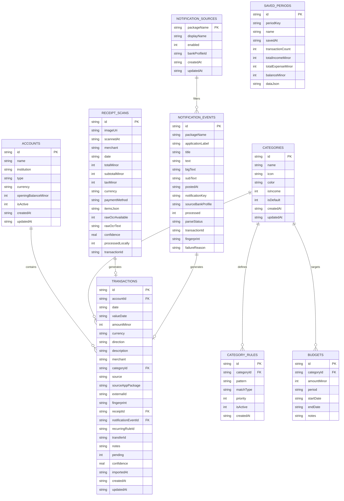

# Data Model & SQLite Schema

This document details the database schema and entity models powering the local-first storage architecture.

---

## 1. Relational Schema Diagram

---

## 2. Integer Minor Currency Units
All monetary amounts are represented as 64-bit integer minor currency units (`amountMinor`):
- **HUF**: 1 HUF = 100 minor units (fillér). E.g. `14 500 HUF` is stored as `1450000`.
- **EUR**: 1 EUR = 100 minor units (cents). E.g. `12.50 EUR` is stored as `1250`.
- **USD**: 1 USD = 100 minor units (cents). E.g. `99.00 USD` is stored as `9900`.

This integer arithmetic model prevents floating-point cumulative rounding errors common in JavaScript and financial spreadsheets.

---

## 3. Account Entity & The Cash Model
Cash is a **first-class account** (`type: 'cash'`) rather than an afterthought:
- Receipt scans with detected cash payment (`KÉSZPÉNZ`) automatically map to the Cash account.
- ATM cash withdrawals from bank accounts create a transfer (`acc_otp` -> `acc_cash`) preserving net worth without double-counting expenses.

---

## 4. Stable Category Identifiers
Category identifiers are canonical and language-independent:
- `food`: Groceries / Élelmiszer
- `dining`: Restaurants & Fast Food / Étkezés & Vendéglátás
- `transport`: Fuel & Public Transit / Tankolás & Közlekedés
- `subscriptions`: Subscriptions & Gaming / Előfizetések & Játék
- `housing`: Utilities & Rent / Rezsi & Szolgáltatás
- `entertainment`: Leisure & Culture / Szórakozás & Szabadidő
- `savings`: Transfers & Savings / Utalás & Megtakarítás
- `income`: Salaries & Income / Fizetés & Bevétel
- `health`: Healthcare & Pharmacy / Egészség & Gyógyszertár
- `shopping`: Clothing & Retail / Bevásárlás & Ruházat
- `other`: Uncategorized / Egyéb

---

## 5. Provenance & Auditability
Every transaction explicitly records its origin:
- `source`: `'notification' | 'receipt' | 'csv' | 'manual' | 'open_banking' | 'backup'`
- `sourceAppPackage`: Package ID of the bank application (e.g., `com.revolut.revolut`).
- `notificationEventId`: Foreign key to `notification_events` record.
- `receiptId`: Foreign key to `receipt_scans` record.
- `fingerprint`: Deterministic hash for duplicate detection.
