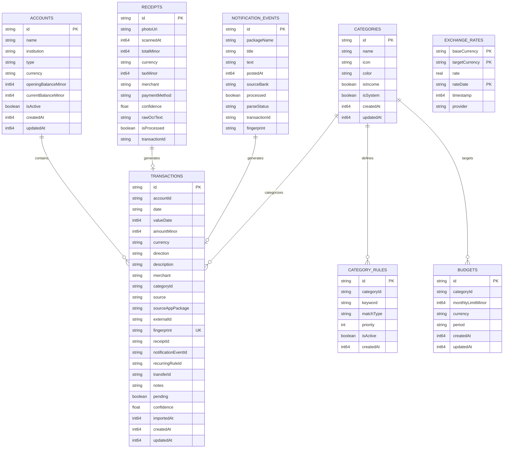

# Data Model & Room SQLite Schema

## 1. Overview & Room Architecture

The application persistence layer is implemented via Android Jetpack Room (`AppDatabase`, version 3). The schema is formally exported to JSON schemas at:
`android-native/app/schemas/com.teppe21.finances.data.local.database.AppDatabase/3.json`

### Core Schema Principles:
1. **Integer Minor Units**: All monetary values (`amountMinor`, `openingBalanceMinor`, `currentBalanceMinor`, `monthlyLimitMinor`, `taxMinor`) are stored as 64-bit integers (`Long`), representing the currency's smallest sub-unit (cents, fillérs).
2. **Deterministic Fingerprints**: Transactions have a unique cryptographic fingerprint preventing duplicate entries.
3. **Optimized B-Tree Indices**: Composite and single-column indices support constant-time deduplication and responsive dashboard rendering.

---

## 2. Entity-Relationship Model

---

## 3. Database Indices & Performance Optimization

### `transactions` Table
| Index Name | Columns | Type | Purpose |
|---|---|---|---|
| `index_transactions_fingerprint` | `fingerprint` | UNIQUE | Deterministic idempotency check ($O(1)$) |
| `index_transactions_externalId` | `externalId` | Non-unique | Bank transaction reference matching ($O(\log N)$) |
| `index_transactions_amount_curr_date` | `amountMinor, currency, date` | Composite | Fast fuzzy duplicate matching across $\pm 2$ day window |
| `index_transactions_accountId` | `accountId` | Non-unique | Account balance calculation and filtering |
| `index_transactions_date` | `date` | Non-unique | Chronological range queries and analytics |
| `index_transactions_categoryId` | `categoryId` | Non-unique | Category breakdown aggregation |

---

## 4. Room Type Converters

Defined in `Converters.kt`:
- **`LocalDate` $\leftrightarrow$ `String`**: ISO-8601 formatted (`YYYY-MM-DD`).
- **`Instant` $\leftrightarrow$ `Long`**: Epoch milliseconds.
- **Enums $\leftrightarrow$ `String`**:
  - `AccountType`: `BANK`, `SAVINGS`, `CASH`, `CARD`, `INVESTMENT`, `LOAN`
  - `TransactionDirection`: `EXPENSE`, `INCOME`, `TRANSFER`, `REFUND`
  - `TransactionSource`: `MANUAL`, `NOTIFICATION`, `RECEIPT`, `CSV`, `RECURRING`
  - `PaymentMethod`: `CASH`, `CARD`, `TRANSFER`, `UNKNOWN`
  - `NotificationParseStatus`: `PARSED`, `NEEDS_REVIEW`, `IGNORED`, `FAILED`

---

## 5. Schema Evolution & Migrations

- **Migration 1 $\rightarrow$ 2**: Added the `exchange_rates` table supporting offline multi-currency conversions and historical ECB rates.
- **Migration 2 $\rightarrow$ 3**: Added `index_transactions_externalId` and the composite index `index_transactions_amountMinor_currency_date` on the `transactions` table to optimize deduplication queries.
