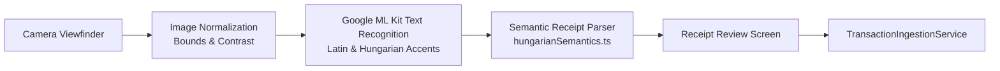

# Receipt Photography & On-Device OCR Pipeline

## 1. Overview
The Receipt OCR system allows users to capture cash or card paper receipts using a specialized camera framing UI, extract structured financial records using on-device optical character recognition (Google ML Kit), and review the result before persisting to SQLite.

---

## 2. On-Device OCR Architecture
To protect user privacy and allow full offline functionality, OCR runs strictly on-device using Google ML Kit Text Recognition:

---

## 3. Hungarian & English Semantic Patterns

### Total Detection (Avoiding Subtotals and Change)
The parser prioritizes semantic keywords over "largest number on receipt" to avoid mistaking amount tendered or change for the total:

- **Total Keywords**: `FIZETENDŐ`, `FIZETENDO`, `FIZETEND0`, `VÉGÖSSZEG`, `ÖSSZESEN`, `TOTAL`, `AMOUNT DUE`
- **Subtotal**: `RÉSZÖSSZEG`, `NETTO`
- **Tax / VAT**: `ÁFA`, `AFA`, `ÁFA TARTALOM`, `VAT`
- **Tendered & Change**: `FIZETETT`, `KÉSZPÉNZ`, `VISSZAJÁRÓ`, `CHANGE`

### Payment Method Detection
- **Cash (`KÉSZPÉNZ`, `KP`, `CASH`)**: Automatically selects the **Cash** account for the transaction.
- **Card (`BANKKÁRTYA`, `CARD`, `VISA`, `MASTERCARD`)**: Selects the primary bank account.

### Merchant Detection
- Known supermarket, fuel, pharmacy, and restaurant chains (e.g. Lidl, Aldi, Spar, Tesco, Auchan, Mol, Shell, Rossmann, DM, Benu, McDonald's).
- First prominent text line after discarding document headers (`NYUGTA`, `SZÁMLA`, `PÉNZTÁR`).

---

## 4. Privacy & Image Storage Controls
- **On-Device Only**: Receipts are never uploaded to third-party cloud OCR services.
- **Separate Image Deletion**: The user can toggle **"Delete photo (keep transaction record)"** to delete the image file from storage while maintaining full financial accounting in SQLite.
